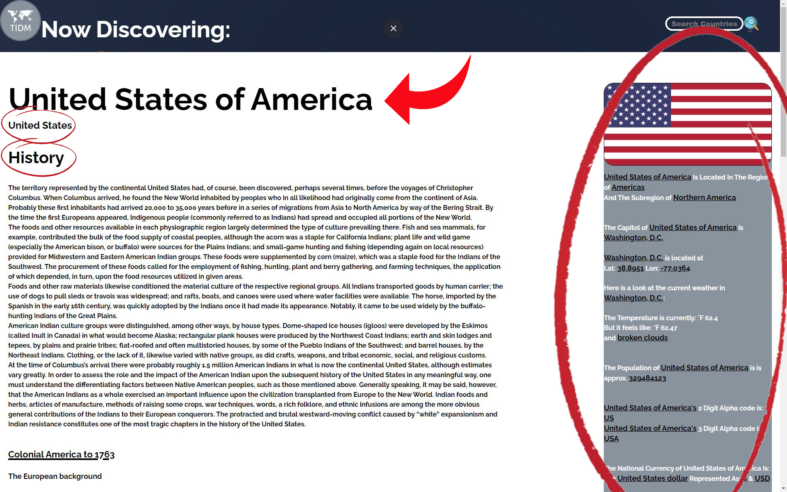
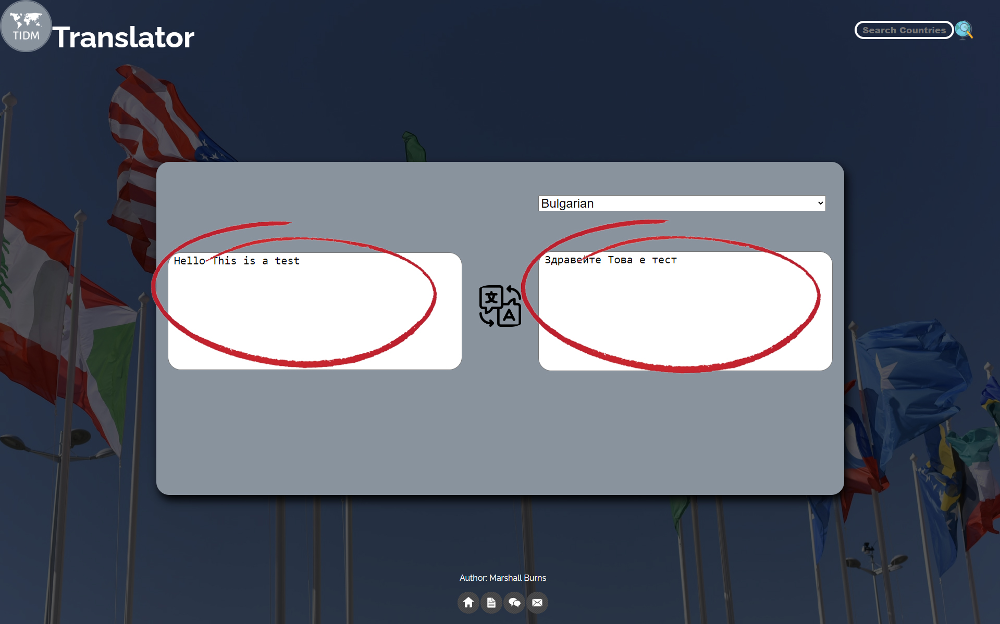

### The What -
Welcome to The International Data Matrix (The IDM) Documentation. This started as my capstone project for my coding boot camp but I have rebuilt and improved it with a new tech stack.

### The Why -
Since I was young I had a great interest in history and geography. For my coding boot camp capstone project I decided to build an app that can be used to help others learn about history and geography. The project not only challenged me but it also gave me a reason to stay motivated throughout the process because it was something I am genuinely interested in.

"Find something you love to do and you'll never work a day in your life."

-Anonymous

### The Tech Stack -
Initially The IDM was built with only HTML, CSS, and vanilla JS. The IDM was rebuilt with the following tech stack:
- [TypeScript](https://www.typescriptlang.org/)
- [React](https://reactjs.org/)
- [Vite](https://vitejs.dev/)
- [NodeJS](https://nodejs.org/en/)
- [Express.js](https://expressjs.com/)
- [MongoDB](https://www.mongodb.com/)
- [npm](https://www.npmjs.com/)
<i>The following npm packages</i>
  - [dotenv](https://github.com/motdotla/dotenv)
  - [nodemon](https://www.npmjs.com/package/nodemon)
  - [Express](https://expressjs.com/)
  - [mongoose](https://www.npmjs.com/package/mongoose)
  - [deepl node](https://www.npmjs.com/package/deepl-node)

Deployed with [Vercel](https://www.vercel.com/)

### Get To The Point -
So with all of that out of the way lets talk about what The IDM is. The International Data Matrix is meant to act as a central place on the internet that anyone can access to gain historical, cultural, religious, geographical, geo-economical and geo-political understanding about any country in the world and the people that reside in them; Without having to go through the clutter of wikipedia or have multiple google tabs open. Another key function of this app is the built-in translator.

### The Home Page -
Anytime someone wants to access The IDM they will be taken to the the [home page](https://internationaldatamatrix.netlify.app/Home). At present the following elements on the home page can be interacted with :

 - The "IDM" Logo/Nav button -

which is located in the top left corner of the page can be clicked and will open the navigation menu on the left side of the screen.

 - The Search Bar -

which is located in the top right corner of the page and is explained in the "The Search Bar" section below.

 - The "View Countries" Button -

which is located beneath the welcome prompt located at the center of the screen and is explained in the "The View Countries Button" section below

 - The Footer Icons -
which is located at the bottom of page/view. Currently there are four icons that will take the user to the following linked wep pages starting from left going right they are:
    - [Home](https://internationaldatamatrix.netlify.app/Home)
    - [Documentation](https://github.com/SchoolyB/Capstone/blob/master/README.md)
    - [Translator](https://internationaldatamatrix.netlify.app/Translator)
    - [Contact](https://internationaldatamatrix.netlify.app/Contact)


### The Search Bar -
The search bar is found on every page and currently acts as a quick and easy tool the user can use to enter letters or full names of a country; once the user has finished entering the desired text they can click the enter key on their keyboard or click the globe icon located to the right the bar to populate all countries whose name fits that search query on screen. *** ***Please Note that at least one letter is required before you can click the globe icon or the enter key***  ***. In the future I hope to add population, gross domestic product, and regional/continental location filtering to this feature.


The search bar allows the user to enter a series of letters to search for a country. For example if the user wants to learn more about the "USA" they could simply type "usa" and press enter or click the search button next to the input field; any country that has the letters that the user entered in that particular order will populate on screen. If the user entered "us" any country with the letters "u" and "s" in that order in its name would populate in screen. For example: A<u>us</u>tralia & Belar<u>us</u>.

<i>Code snippet for the search feature</i>
[Header.tsx]("client/src/components/Header.tsx")
```
<input
    placeholder="Search Countries"
    id="countryFilter"
    name="countryFilter"
    type="text"
    required
    value={search.value}
    onChange={(event) => {search.value = event.target.value}}>
</input>
```
The search bar works the same way with singular letters. IF the user wants to to search through any country that has a "u" in its name they can simply type "u" and once they press enter and country with "u" in its name no matter where the letter is will populate on screen. For example: A<u>u</u>stralia, Belar<u>u</u>s, S<u>u</u>dan, <u>U</u>nited Kingdom, & Venez<u>u</u>ela.

### The View Countries Button -
When clicked the View Countries button on the home screen will take the user to the [country selection](https://international-data-matrix.vercel.app/Countries) page where they have will be able to choose from a full list of countries that are currently supported withing the application.

### Country Selection Page    -
The country selection page shows a container in the center of the page that houses a "country tab" dedicated to each country that is currently integrated into the "IDM". Each "country tab" has a country's name, region, population, GDP, land mass in square miles and an image of that countries flag.

Defining the objects from the DB with an interface

```
export interface CountryListData{
  _id: string
  name: string
  region: string
  population: number
  area: number
  gdp: string
  flag: string
  flagAlt: string
  link: string
}
```

An example of a dataset within MongoDB

```
{
  "_id": {
    "$oid": "6411e5e9a825fe482d0215b8"
  },
  "name": "My Country",
  "region": "My Region ",
  "population": 123456789,
  "area": 12345,
  "gdp": "$ 1 billion USD",
  "flag": "/assets/countrySelectionFlags/flag-of-My-Country.png",
  "flagAlt": "The Flag of My Country",
  "link": "country/mc"
}
```
Making axios call to API to get country data from DB
```
import axios from "axios";
const countryKey = import.meta.env.VITE_COUNTRY_API_KEY

export const getCountrySelectionData = () => {
  return axios
    .get(
      `https://countryapi.io/api/all?apikey=${countryKey}`,
    )
    .then((res) => res.data)
}
```

Displaying data from the axios call response to web page
```
    return (
      <div className="country">
        <h3 className="countryHeading">{country.name}</h3>
        <a href={country.link}>
          
        </a>
        <div className="data">
          <p>Region: {country.region}</p>
          <p>Population: {country.population}</p>
          <p>GDP: {country.gdp}</p>
          <p>Area(sq. mi){country.area}</p>
        </div>
      </div>
    )
```

<!-- possibly  build repo for api and add more data to it-->
 The header of the "country selection" page gives clear instructions to users on what they can. Once the user hovers over a country tab's flag a bouncing animation will start. Once the user clicks on the flag they will be taken to the corresponding page for that country.


### A Country Page -
Every country that is currently supported in the International Data Matrix has a corresponding "Country Page". A country page displays data that was queried from the following API sources:

- [The News API](https://www.thenewsapi.com/)
- [Rest Countries](https://restcountries.com/)
- [OpenWeather](https://openweathermap.org/api)

The History sections of each country page are populated with text that was "hard-coded" into the html due to the fact that I couldn't find a free API that had the large amount of data that was needed to build the project the way I wanted to.

Each country's name in English is displayed at the top of the page as an h1 element. Beneath that h1 element is an h2 element that displays the name of the country in the native language of that country.

For each country page there is a "meta data container" on the right side of the page that houses the following data from the [Rest Countries](https://restcountries.com/) API & the [OpenWeather](https://openweathermap.org/api) API:

- The Region and Subregion of the country is in
- The name of the capitol city of the country
- The latitude and longitude coordinates of the capitol city
- The current weather and temperature in fahrenheit in the capitol city
- The approximate population of the country
- The country's 2 & 3 digit alpha codes
- The country's national currency information
- The country's calling code
- All the timezones that are within the country

Here is a code snippet of the a country page's meta data container

``` <div class="metaDataContainer">
      
      <div class="genInformationContainer">
      <p class="genInfoRegion">
          <u>${state.info.name}</u> Is Located In The Region of
          <u>${state.info.region}</u><br />
          And The Subregion of <u>${state.info.subregion}</u>
        </p>
        <p class="genInfoSubRegion"></p>
        <p class="genInfoCapitolCity">
          The Capitol of <u>${state.info.name}</u> is
          <u>${state.info.Capital}</u><br></br>
          <u>${state.info.Capital}</u> is located at<br> Lat: <u>${
  state.Weather.lat
}</u> Lon: <u>${state.Weather.lon}</u><br><br>

```




### The Translator -
My favorite feature...the built in translator using the [DeepL](https://www.deepl.com/translator) translator API. The IDM translator has an input area on the left of the gray container and an output area on the right. A user can select any languages from the drop-down menu located above the output area. ***NOTE THAT CURRENTLY THE ONLY SUPPORTED INPUT LANGUAGE IS ENGLISH*** When the user is ready to translate a letter, word, or phrase they can click the translate button located between the input and output areas to submit the data for translation.


Here is an example of how the selection dropdown looks.


Here is an example of an input in English and an output in the desired language of Bulgarian.


Here is a snippet of code from [App.js](https://github.com/SchoolyB/International-Data-Matrix/blob/master/server/app.js)

```
const deepl = require("deepl-node");

app.post("/translator", (request, response) => {
  const translator = new deepl.Translator(process.env.TRANSLATION_KEY);

  const sourceText = request.body.sourceText;
  const outputLanguage = request.body.outputLanguage;
  translator
    .translateText(sourceText, null, outputLanguage)
    .then(result => {
      console.log(result.text); // Bonjour, le monde !

      const responseBody = {
        //if a key in an obj doesnt have a colon anf a value JS auto assumes that the value is itself
        // same as writting sourceText: sourceText
        text: result.text //this
      };

      response.json(responseBody);
    })
    .catch(error => {
      console.error(error);
    });
});

```

Here is a snippet of code from [root index.js](https://github.com/SchoolyB/International-Data-Matrix/blob/master/index.js)

```
switch (state.view) {
    case "Translator":
      const form = document.getElementById("fullTranslateContainer");
      const output = document.getElementById("translateOutput");
      form.addEventListener("submit", event => {
        event.preventDefault();
        const inputs = event.target.elements;
        const sourceText = inputs.translateInput.value;
        const outputLanguage = inputs.outputLangSelect.value;
        const requestBody = {
          sourceText,
          outputLanguage
        };
        axios
          .post(
            "https://theinternationaldatamatrix.onrender.com/translator",
            requestBody
          )
          .then(response => {
            store.Translator.outputText = response.data.text;
            console.log(store.Translator.stuffs);
            output.value = response.data.text;
          });
      });
      break;
  }

```


### The Contact Page -
The contact page can be used for users to send their feedback to an email that was setup just for that purpose. The form uses a POST method and a [Formspree](https://formspree.io/) url as the action to send the data on submit. Feel free to give it a try :)

```
 <form action="https://formspree.io/f/mknelldn" method="POST">
      <label  class="contactLabel"id="contactName">
        <input class="contactInput" type="text" name = "name" placeholder="Enter your name"></input>
      </label>

```


