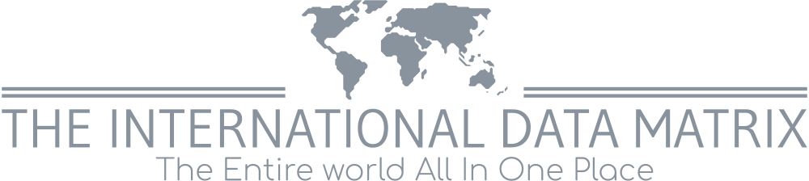

### The What -
Welcome to The International Data Matrix (TIDM) Documentation. This started as a capstone project for my coding boot camp but I want to see it grow and see others use it.

### The When -
This project is still a work in progress. That being said nothing is finalized and all code is subject to change.

### The Why -
Being such a fan of history and geography. I thought it best to make this project not only to challenge myself but also give myself a reason to stay motivated throughout the process.

"Find something you love to do and you'll never work a day in your life."

-Anonymous

### The How -
This project is a SPA(single page application) was done in Vanilla JavaScript. Our boot camp <b><i>PROHIBITED</i></b> the use of certain softwares, frameworks, and libraries including but not limited to:
- [React](https://reactjs.org/)
- [Angular](https://angular.io/)
- [Vue](https://vuejs.org/)
- [Svelte](https://svelte.dev/)
- [Sass](https://sass-lang.com/)
- [Tailwind CSS](https://tailwindcss.com/)
- [Bootstrap](https://getbootstrap.com/)

Or anything similar to the tools listed above

My understanding of the reasoning behind the decision to not allow use to use those particular tools is so that we(the students) focus on vanilla HTML/CSS & JavaScript so when the time comes to learn those new tools we are already ahead rather that starting completely from scratch. <b><i>SOME<i> </b>of the tools we are allowed to use for this project are as follows:
- [NodeJS](https://nodejs.org/en/)
- [Parcel](https://parceljs.org/)
- [Navigo](https://github.com/krasimir/navigo)
- [npm](https://www.npmjs.com/)
- [The lit-html vscode extension](https://marketplace.visualstudio.com/items?itemName=bierner.lit-html)

***The above list will be updated as the course continues***

### Get To The Point -

So with all of that out of the way lets talk about what TIDM is. The International Data Matrix is a web app developed by Marshall Burns a.k.a Schooly. The application is meant to act as a central place on the internet that anyone can access to gain historical, cultural, religious, geographical, geo-economical and geo-political understanding about any country in the world and the people that reside in them; Without having to go through the clutter of wikipedia or have multiple google tabs open. Another key function of this app <b><i>WILL</i></b> be the built in translator.

