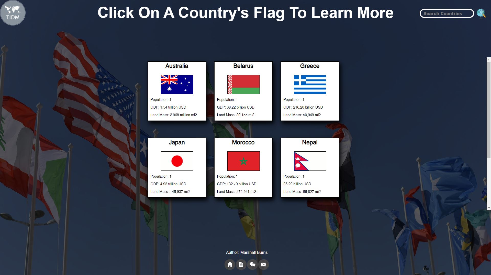
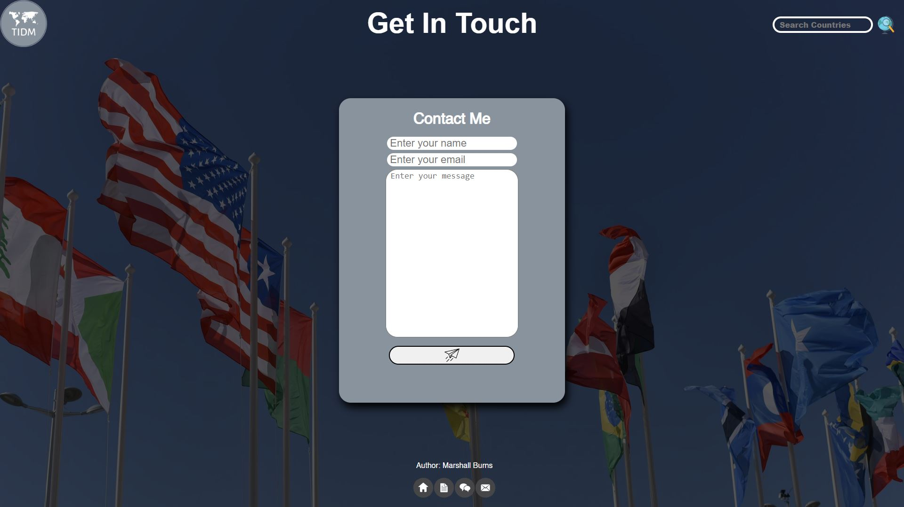

### The What -
Welcome to The International Data Matrix (TIDM) Documentation. This started as a capstone project for my coding boot camp but I want to see it grow and see others use it.

### The When -
This project is still a work in progress. That being said nothing is finalized and all code is subject to change.

### The Why -
Being such a fan of history and geography. I thought it best to make this project not only to challenge myself but also give myself a reason to stay motivated throughout the process.

"Find something you love to do and you'll never work a day in your life."

-Anonymous

### The How -
This project is a SPA(single page application) was done in Vanilla JavaScript. Our boot camp <b><i>PROHIBITED</i></b> the use of certain softwares, frameworks, and libraries including but not limited to:
- [React](https://reactjs.org/)
- [Angular](https://angular.io/)
- [Vue](https://vuejs.org/)
- [Svelte](https://svelte.dev/)
- [Sass](https://sass-lang.com/)
- [Tailwind CSS](https://tailwindcss.com/)
- [Bootstrap](https://getbootstrap.com/)

Or anything similar to the tools listed above

My understanding of that decision is so that we(the students) focus on vanilla HTML/CSS & JavaScript so when the time comes to learn those new tools we are already ahead rather that starting completely from scratch. The following list contains the specific tools for the tech stack that I used for this project:
- [VS Code](https://code.visualstudio.com/)
- [NodeJS](https://nodejs.org/en/)
- [npm](https://www.npmjs.com/)
  <i>The following npm packages</i>
  - [serve](https://www.npmjs.com/package/serve)
  - [html-literal](https://www.npmjs.com/package/html-literal)
  - [parcel](https://parceljs.org/)
  - [lodash](https://www.npmjs.com/package/lodash)
  - [navigo](https://github.com/krasimir/navigo)
  - [dotenv](https://github.com/motdotla/dotenv)
  - [nodemon](https://www.npmjs.com/package/nodemon)
  - [mongoose](https://www.npmjs.com/package/mongoose)
- [The lit-html vscode extension](https://marketplace.visualstudio.com/items?itemName=bierner.lit-html)
- [Express.js](https://expressjs.com/)
- [Netlfiy](https://www.netlify.com/?utm_source=google&utm_medium=paid_search&utm_campaign=12755510784&adgroup=118788138897&utm_term=netlify&utm_content=kwd-371509120223&creative=514583565825&device=c&matchtype=e&location=9021584)
- [Insomnia](https://insomnia.rest/)
- [MongoDB](https://www.mongodb.com/)
- [Render](https://render.com/)

### Get To The Point -

So with all of that out of the way lets talk about what TIDM is. The International Data Matrix is a web app developed by Marshall Burns a.k.a Schooly. The application is meant to act as a central place on the internet that anyone can access to gain historical, cultural, religious, geographical, geo-economical and geo-political understanding about any country in the world and the people that reside in them; Without having to go through the clutter of wikipedia or have multiple google tabs open. Another key function of this app <b><i>WILL</i></b> be the built in translator. An example of each page will be given to explain how the application works. These examples  will be provided in the form of screenshots. There will also be code snippets to explain in greater detail how this SPA was made.

### Project Structure -
As mentioned in [The How](https://github.com/SchoolyB/Capstone/tree/master#the-why--) section one of the stipulations for  this project was that I could not use any frameworks/libraries like React, Angular, Vue, Svelte, etc. Because of that the SPA had to be built using vanilla JavaScript components, views, state, and bundled all up with [Parcel](https://parceljs.org/). Below are examples of the projects code directory structure.
###### <i>"ROOT" DIRECTORY STRUCTURE</i>

###### <i>"COMPONENTS" DIRECTORY STRUCTURE</i>
Click [here](https://github.com/SchoolyB/Capstone/tree/master/components) to visit the "components" directory

###### <i> "VIEWS" DIRECTORY STRUCTURE</i>
Click [here](https://github.com/SchoolyB/Capstone/tree/master/components/views) to visit the "views" directory

###### <i>"STORE" DIRECTORY STRUCTURE</i>
Click [here](https://github.com/SchoolyB/Capstone/tree/master/store) to visit the "store' Directory

 *** NOTE THAT ALL SCREENSHOTS BELOW ARE A REPRESENTATION OF HOW THE APPLICATIONS PAGES OR "VIEWS" LOOKED WHEN CREATING THE DOCUMENTATION AND WILL BE UPDATED AS THE PAGES CONTINUE TO UPDATE ***
### The Home Page -
Anytime someone wants to access The IDM they will be taken to the the [home page](https://internationaldatamatrix.netlify.app/Home). At present the following elements on the home page can be interacted with :

 - The "IDM" Logo/Nav button -

which is located in the top left corner of the page can be clicked and will open a the navigation menu on the left side of the screen.

 - The Search Bar -

which is located in the top right corner of the page and is explained in the "The Search Bar" section below.

 - The "View Countries" Button -

which is located beneath the welcome prompt located at the center of the screen and is explained in the "The View Countries Button" section below

 - The Footer Icons -
which located at the bottom of page/view. Currently there are four icons that will take the user to the following linked wep pages starting from left going right they are:
    - [Home](https://internationaldatamatrix.netlify.app/Home)
    - [Documentation](https://github.com/SchoolyB/Capstone/blob/master/README.md)
    - [Translator](https://internationaldatamatrix.netlify.app/Translator)
    - [Contact](https://internationaldatamatrix.netlify.app/Contact)

### The Search Bar -
The search bar is one of my favorite elements of the application. The search bar is found on every page and currently acts as a quick and easy tool the user can use to enter letters or full names of a country; once the user is has finished entering that text they can click the enter key on their keyboard or click the globe icon located to the right the bar to populate all countries whose name fits that search on screen. *** ***Please Note that at least one letter is required before you can click the globe icon or the enter key***  ***. In the future I hope to add population, gross domestic product, and regional/continental location filtering to this feature.

The search bar allows the user to enter a series of letters to search for a country. For example if the user wants to learn more about the "USA" they could simply type "usa" and press enter or click the search button next to the input field; any country that has the letters that the user entered in that particular order will populate on screen. If the user entered "us" any country with the letters "u" and "s" in that order in its name would populate in screen. For example: A<u>us</u>tralia & Belar<u>us</u>.

The search bar works the same way with singular letters. IF the user wants to to search through any country that has a "u" in its name they can simply type "u" and once they press enter and country with "u" in its name no matter where the letter is will populate on screen. For example: A<u>u</u>stralia, Belar<u>u</u>s, S<u>u</u>dan, <u>U</u>sa, & Venez<u>u</u>ela.

### The View Countries Button -
When clicked the View Countries button on the home screen will take the user to the [country selection](https://internationaldatamatrix.netlify.app/Countries) page where they have will be able to choose from a full list of countries that are currently supported withing the application.

### Country Selection Page    -

### A Country Page -
### The Translator -

### The Contact Page -

